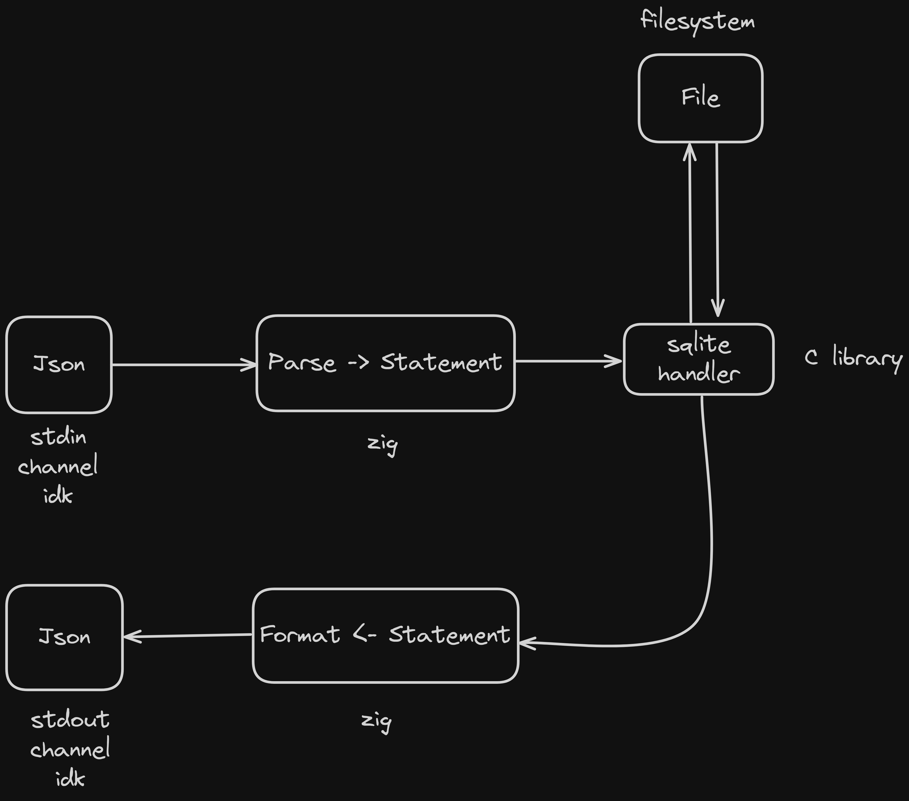

# Asyndete Core
Can be used both as a library or a standalone binary 
The library can be used to extend or integrate the project 
The binary can be used for your own, or to be queried by other apps

## Building
*For NixOS users, just run `nix develop`*

### Manual
You will need `zig` and the `sqlite3` lib for C 
Installing Zig : https://github.com/ziglang/zig/wiki/Install-Zig-from-a-Package-Manager 
Installing sqlite3 : **[TODO]**

`zig build run` -> Run the binary as a standalone 
`zig build test` -> Test that the binary works on your machine

### Docker
**WIP**

## Schema
